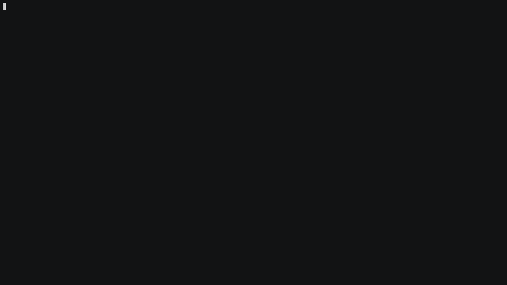

  

<h1 align="center">ingraind</h1>

 <strong>
   Data-first Monitoring
 </strong>

 
 

ingraind is a security monitoring agent built around [RedBPF](https://github.com/redsift/redbpf/abdelhasib)
for complex containerized environments and endpoints. The ingraind agent uses eBPF
probes to provide safe and performant instrumentation for any Linux-based environment.

InGrain provides oversight of assets and risks:
 * Your customer data - an employee copying your customer database to their
   personal cloud store.
 * Your infrastructure - an attacker executing a zero day attack to gain access
   to your web servers.
 * Your resources - malware using your users machines compute resources to mine
   cryptocurrency.

This is what `curl https://www.linkedin.com/in/abdelhasib-naamaoui/` looks like if seen through ingraind:

## Requirements

 * LLVM/Clang version 9 or newer
 * Rust toolchain [rustup.rs](https://rustup.rs)
 * Linux 4.15 kernel or newer including kernel headers
 * capnproto

## Compile

The usual Rust compilation ritual will produce a binary in `target/release`:

    $ cargo build --release

or for a kernel version other than the running one:

    $ export KERNEL_VERSION=1.2.3
	$ cargo build --release

or with a custom kernel tree path (needs to include generated files):

    $ export KERNEL_SOURCE=/build/linux
	$ cargo build --release
	
We keep `ingraind` compatible with the `musl` target on `x86_64`,
which you can build like so:

	$ cargo build --release --target=x86_64-unknown-linux-musl

## Build a docker image

To build a Docker image, use the instructions above to build an
ingrain binary for the desired kernel. By default, the Dockerfile will
assume you've built `ingraind` for the `musl` target.

    $ docker build .

You can specify an arbitrary `ingraind` binary by setting the
`BINARY_PATH` environment variable:

    $ docker build --build-arg BINARY_PATH=./target/x86_64-unknown-linux-musl/release/ingraind .

## Configuration & Run

To get an idea about the configuration [file
structure](https://github.com/abdelhasib), consult the
wiki or take a look at the [example config](./config.toml.example) for a full reference.

To start `ingraind`, run:

    $ ./target/release/ingraind config.toml

Depending on the backends used in the config file, some secrets may need to be
passed as environment variables. These are documented in
[config.toml.example](./config.toml.example), which should be a good starting point,
and a sane default to get `ingraind` running, printing everything to the standard output.

## Repo structure

The `bpf` directory contains the BPF programs written in C. These are compiled
by `build.rs`, and embedded in the final binary, and will be managed by the
grains.

The `ingraind-probes` directory contains the BPF programs written in Rust.

# Anything else?

For more information, take a look at the [Wiki](https://github.com/abdelhasib/wiki)

# Contribution

This project is for everyone. We ask that our users and contributors
take a few minutes to review our [code of conduct]((https://github.com/abdelhasib)

Unless you explicitly state otherwise, any contribution intentionally submitted
for inclusion in the work by you, as defined in the GPL-3.0 license, shall
be licensed as GPL-3.0, without any additional terms or conditions.

For further advice on getting started, please consult the
 Please
note that all contributions MUST contain a 
sign-off line.
Abdelhasib Naamaoui
